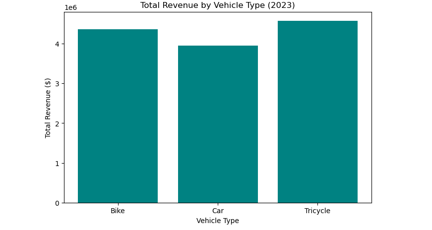

# Data Analytics Project (python)

 **Dataset:** `rideshare_trips_2021_2023.csv`  
 **Solution File:** `razi.ipynb`  
 **Tool Used:** Jupyter Notebook (Python & Pandas)

---

## Question / Task Description
You're given a CSV file containing ride-sharing trip data from **2021 to 2023**.  
Each row contains the following columns:
- Driver ID  
- Trip Date  
- Trip Fare  
- City  
- Vehicle Type  

### Objectives
1. For each row, determine how many trips that driver had already completed before that trip.  
2. Based on that, assign a **Driver Tier**:
   -  **New Driver:** First trip  
   -  **Regular Driver:** 1–49 previous trips  
   -  **Veteran Driver:** 50+ previous trips  
3. Calculate the **total earnings** contributed by each Driver Tier (rounded to 2 decimal places).  
4. Create two visualizations:
   - A **multi-line chart** showing **monthly total fares by City** (Jan 2021 – Dec 2023).  
   - A **bar chart** comparing **total fares by Vehicle Type**, using **2023 data only**.

---

## Repository Contents
| File | Description |
|------|--------------|
| `rideshare_trips_2021_2023.csv` | Raw dataset containing trip records |
| `razi.ipynb` | Jupyter notebook containing full solution and analysis |
| `line-chart.png` | Monthly total fares by City (Line Chart) |
| `bar-chart.png` | 2023 total fares by Vehicle Type (Bar Chart) |
| `README.md` | Project documentation |

---

## Total Earnings by Driver Tier

| Driver Tier | Definition | Total Earnings ($) |
|--------------|-------------|--------------------|
| **New Driver** | First trip | *[2282890.27]* |
| **Regular Driver** | 1–49 previous trips | *[35798376.70]* |


---

## Visualizations

### 1 ️Monthly Total Fares by City (2021–2023)
This line chart shows how total fares evolved across cities over time.


### 2 Total Fares by Vehicle Type (2023)
This bar chart compares fare totals for each vehicle type in 2023.



---

## Solution Overview (Python Steps)
1. **Load Dataset**
   ```python
   import pandas as pd
   df = pd.read_csv('rideshare_trips_2021_2023.csv')

2. **Sort and Group**

   df = df.sort_values(['Driver ID', 'Trip Date'])
   df['Prev Trips'] = df.groupby('Driver ID').cumcount()


3. **Assign Driver Tier**

   def tier(x):
       if x == 0:
           return 'New Driver'
       elif x <= 49:        # or x < 50:
           return 'Regular Driver'
       else:
           return 'Veteran Driver'
   df['Driver Tier'] = df['Prev Trips']

4. **Calculate Total Earnings per Tier**

   earnings = df.groupby('Driver Tier')['Trip Fare'].sum().round(2)
   print(earnings)


5. **Create Charts**

   Line chart: Monthly revenue trend by City

   Bar chart: Total fare by Vehicle Type (2023 only)

## Insights

Veteran Drivers contributed the highest earnings overall.

Regular Drivers showed consistent engagement with stable earnings.

New Drivers made fewer trips but represent growth potential.

Some cities experienced seasonal revenue changes between 2022 and 2023.

## Author

Project by [Abdulkarim Abdulrazak]


